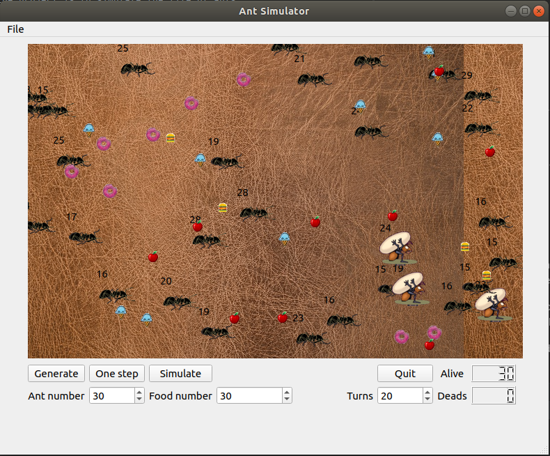

# ANT_Project

##Description : ##

The aim of the project is to simulate the life of ants.
It will looks like this:

  

To launch the project use the command line :

python3 ui.py

##Explanation :##

In this simulation you can choose the number of Ant at the beginning, 
the quantity of food available and how the simulation is (using the number of turn).

The ants are in 2 categories, classic ant (80%) and big ants. The only differences is that the amount of initial 
health for big ants is twice the number of the classic ones.

When they are low, they tried to find food around. When the health reach 0, they died 
and a grave appear. 
